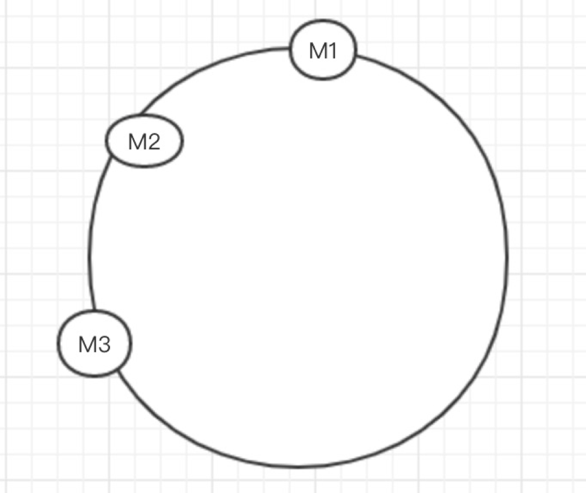
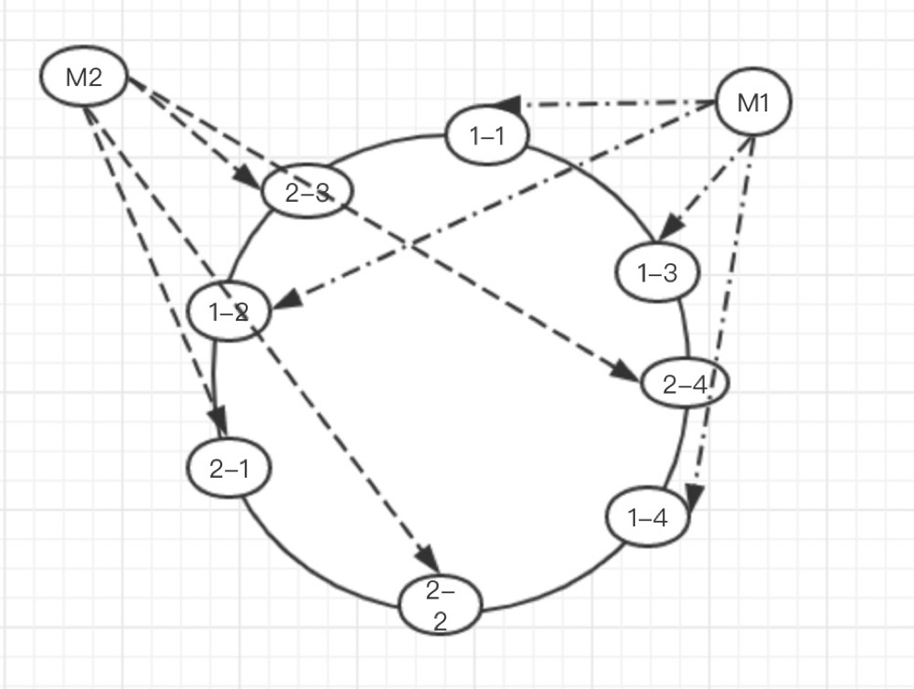

> 之前有提到，通过集群可以提高存储服务的容量，今天就来聊一聊分布式存储服务是如何把数据分布到集群的各个节点上的

### 数据分布算法的演进
#### HASH
&emsp;&emsp;通过存储key的hash值对节点个数取模，根据余数分配指定节点
&emsp;&emsp;通过HASH算法已经能有效的将数据分配到不同的节点了，但是当节点变动（新增或下线）的时候，所有的数据都需要重新分配
#### 一致性HASH

>1. 首先生成一个长度为2^32的环
>2. 根据节点的某个特征（比如ip地址）的hash值，将节点放到这个环上
>3. 当有数据进来的时候，计算key的hash值，这个时候如果key的hash值和某个节点的hash一样（想的美），数据就放到该节点
>4. 没有命中就顺时找到第一个节点，这个节点就是数据最终会存到的点

&emsp;&emsp;这样如果有一个节点下线，或者新增一个节点，最终就是有变动的那个节点和顺时针找到的下一个节点的数据可能会受到影响
&emsp;&emsp;但是如果节点比较少（其实哪怕节点不少），很容易因为节点在环上分布不均匀而导致各个节点上的数据量有较大的差异
#### 带虚拟节点的一致性HASH

步骤仍然和一致性hash一样，区别在于
* 将每个节点虚拟成多个节点，比如在ip后面加上编号（0-1023）把节点虚拟成1024个
* 将每个虚拟节点根据Hash值放到环上（这个时候分布就均匀多了）
* 然后通过虚拟节点和实际节点之间的映射来判断key在哪个节点

###数据分布算法的特点
看了算法演进过程之后，我们再来看看这其中体现了我们对数据分布的哪些要求
1. 稳定性  
    一个key根据数据分布算法计算的分布位置应该保持稳定，即使有节点发生变化
2. 均匀分布  
    数据分布算法应该把key均分分配到各个节点上，避免数据倾斜
