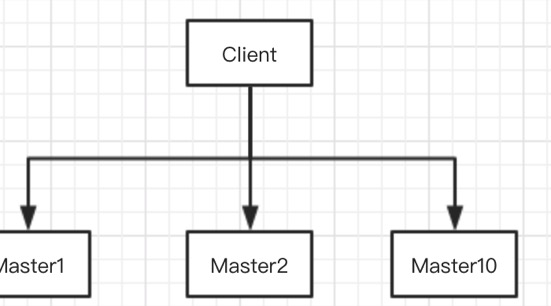
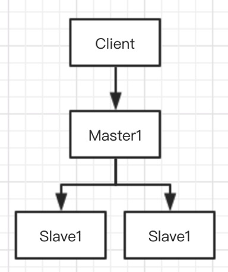
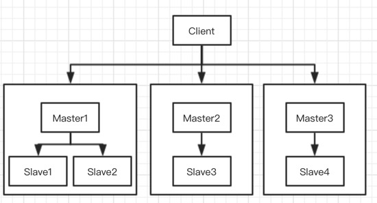

> "没有什么问题是加机器解决不了的，如果有，那就再加几台"  
> 最近看redis集群，又抽时间了解了一下常规存储服务的主从备份，决定把"加机器"这件事情写得高大上一些

> 以下场景大部分都是虚构，如有雷同，我也不背锅
## 背景：
&emsp;&emsp;我司是一家电商公司，会将热点商品信息缓存到redis中，提高相应速度，减轻数据库的访问压力
## 场景1
&emsp;&emsp;随着业务发展，用户越来越多，入驻的商家越来越多，商品种类越来越多，慢慢的，哪怕只是存热点数据，我们的redis机器也放不下了
## 场景2
&emsp;&emsp;像我这样的穷B，没事就喜欢翻淘宝翻京东，看看键盘啊、内存啊什么的，但是没钱啊，就只能看看，也买不起  
&emsp;&emsp;本来穷不是我的错，但是穷还出来捣乱就不对了啊，穷B太多，访问量太大，缓存服务背不住，死掉了...
## 场景3
&emsp;&emsp;这还不是最可怕的，最可怕的是，全世界像我这样的男性穷B，可能都就喜欢翻那么几件商品 
 

## 加机器之——集群
> 毕竟没有什么问题是加机器不能解决的嘛

&emsp;&emsp;通过搭建redis集群，把不同的商品数据存储到不同的节点里面，这样原本只有一台机器只能存10G数据，现在扩展到10台，可以存100G了，又可以挥霍好长时间了  
&emsp;&emsp;不仅如此，机器变多了，每台redis服务访问压力也变小了，完美  
&emsp;&emsp;场景1、2已经解决了，可是场景3还是没法处理，比如硬盘的数据存在编号为1的节点上，那这台机器完蛋了，访问量全在这里，根本背不住  

## 加机器之——主从备份
> 如果有，就再加一台

&emsp;&emsp;现在对1节点进行扩容，增加到两台（注意：这里和集群不一样，集群上不同的节点保存的数据并不一样，这里的主从备份不同机器保存同一份数据）
&emsp;&emsp;这下好了，访问可以打到两台机器上，勉强能承受了，承受不了再加

## 场景4

&emsp;&emsp;主从节点能有效分散访问压力，但是偶尔又高峰期，访问量特别大  
&emsp;&emsp;这本来不是太大的问题，毕竟在高峰期损失部分可用性来也不是不能接受的  
&emsp;&emsp;可是因为服务压力太大，导致用户下单的时候库存变更的数据无法更新到缓存里面去，这就严重影响用户体验了

### 主从备份——读写分离

&emsp;&emsp;我们给节点1的几台机器进行以下分工，其中Master只负责写需求，后面的Slave负责读需求。这样哪怕负责读的节点被打爆，也不会影响数据的更新了

最后我们的架构就是这样的，总结一下优点
* 提升存储空间
* 高可用（Master下线后Slave升级为Master）
* 方便扩展（一般读的需求提升比较快，只需要新增Slave节点即可）

## 挖个坑
* 如何把数据分布到集群的各个节点上（以后填吧）
* 主从节点数据的同步（...）
* master下线之后的剔除和重新选举（很多分布式服务都会用到的哨兵机制，等我什么时候抽时间提一提）